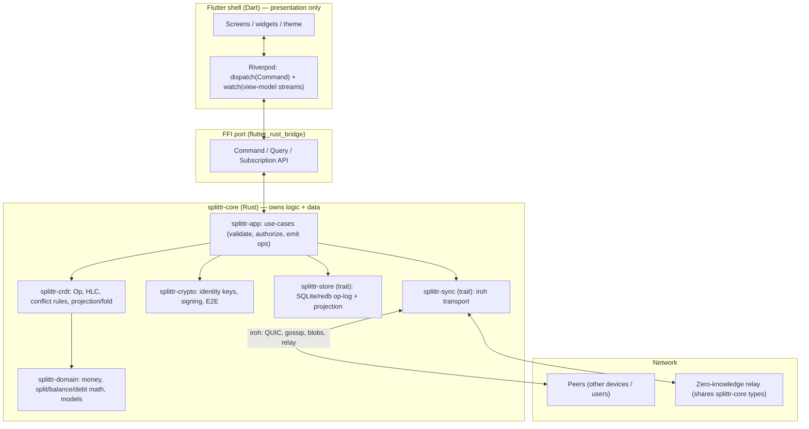

# Splittr — Architecture Overview & Map

> **Status:** living document. This is the *current coherent picture* of the
> system. The *why* behind each decision lives in the ADRs (`docs/adr/`); the
> *work* lives in the GitHub issues (Epic #18). When they disagree, an accepted
> ADR wins and this map should be updated to match.

## 1. What we are building

A local-first, multi-device, multi-user expense-sharing app (a Splitwise
clone). The defining architectural choice (ADR-0003): a **Rust engine that owns
all of the logic and data, behind a clean FFI port, with Flutter as a
presentation shell.**

### Guiding principles
1. **Local-first & offline-first** — every device holds the full truth; the
   network only synchronizes.
2. **Event-sourced** — the source of truth is an append-only log of signed
   operations; all state is a deterministic *fold* (ADR-0001).
3. **CRDT-convergent** — any two replicas with the same op-set compute identical
   balances, with no central authority.
4. **Deterministic, pure core** — the engine has no hidden I/O in its logic;
   given the same ops it always produces the same projection. This is what makes
   it testable and convergent.
5. **Hexagonal / ports-and-adapters** — the core depends on *traits*
   (`Store`, `Transport`, `Clock`, `Crypto`); concrete adapters (SQLite, iroh,
   system clock) plug in at the edges.
6. **Frontend-agnostic core** — Flutter is the first consumer, not the only
   possible one; the same engine can power a relay/server, a CLI, or tests.
7. **Encrypted** — at rest (#22) and end-to-end for synced ops so relays are
   zero-knowledge (#14).
8. **Rigorously tested** — property-based convergence testing is the headline
   bar (ADR-0001 §Testing).

## 2. High-level view



## 3. Component map (crate decomposition)

| Crate / layer | Responsibility | Key deps / seams | Issues |
|---|---|---|---|
| `splittr-domain` (Rust) | Value types (`Cents`, ids), split/balance/debt math, expense model | `serde`; pure, no I/O | #2, #3, #15, #19 |
| `splittr-crdt` (Rust) | `Op`, `Hlc`, content-addressed ids, conflict resolution, `authorize` (entitlement) + `materialize` (value fold) | `splittr-domain`, `serde`, `postcard`, `blake3` | #1, #7, #8, #15, #19, #38 |
| `splittr-crypto` (Rust) | Identity/device keypairs, signing/verify, AEAD at-rest, recovery phrase, root vault, pairing SAS, invite tokens | `ed25519-dalek`, `x25519-dalek`, `chacha20poly1305`, `argon2`, `bip39`, `blake3` | #6, #7, #14, #16, #22, #34, #35 |
| `splittr-store` (Rust) | Persist op-log + materialized projection; encryption at rest | trait `Store`; `rusqlite`/`redb` | #1, #22 |
| `splittr-sync` (Rust) | Discovery, transport, set reconciliation, blob transfer | trait `Transport`; `iroh`, `iroh-gossip`, `iroh-blobs` | #9, #20 |
| `splittr-app` (Rust) | Use-cases: command handling, authorization, query/subscription | composes the above | #19, #23 |
| `splittr-ffi` (Rust↔Dart) | `flutter_rust_bridge` surface; marshals commands & view-models | FRB codegen → `lib/src/rust/` | #23 |
| Flutter shell (Dart) | Screens, theme, navigation, reactive binding to FFI streams | `flutter_riverpod`, FRB | #24, +UI of every feature |
| Backend/services | Payment providers, open-banking aggregator, relay hosting | external | #10, #17, #20 |

## 4. Data flow

**Write path (a user adds an expense):**
```
UI intent → Command::AddExpense{…}      (Dart → FFI)
  → splittr-app validates + authorizes (membership, lock state)
  → builds splits (splittr-domain), creates a signed Op (splittr-crypto)
  → appends Op to the log (splittr-store)
  → materializer folds the new Op into the projection (splittr-crdt)
  → changed view-models pushed on a Stream  (FFI → Dart)
  → Riverpod rebuilds the affected widgets
```

**Sync path:**
```
local Op → splittr-sync broadcasts via iroh-gossip; range reconciliation fills gaps
inbound Op → verify signature + authorization → apply (idempotent, dedup by id)
  → projection updates → view-model streams → UI
```
Balances are never sent over the wire — only ops. Every replica recomputes them
by folding, guaranteeing agreement (ADR-0001).

## 5. The FFI contract

The port is intentionally small and stable: **commands in, view-models/streams
out.** Illustrative shape (final names TBD in #23):

```
dispatch(command: Command) -> Result<(), AppError>          // mutations
query_*(args) -> ViewModel                                  // one-shot reads
watch_*(args) -> Stream<ViewModel>                          // reactive reads
```

The UI owns no business state; it renders view-models and emits commands. This
keeps the Dart side thin and lets the engine evolve without UI rewrites.

## 6. Data model (summary; full detail in ADR-0001)

- **Op** = `{ id: blake3(content), type, payload, hlc, author_device, author_identity, sig }`.
- **HLC** `(wall_ms, counter, site_id)` for a causal, deterministic total order.
- **Conflict rules:** immutable facts → grow-only set (dedup by id); scalars &
  membership → LWW by HLC; expense edits → **whole-version LWW**; deletes →
  **monotonic, terminal tombstone (delete-wins)**; claim/merge → alias
  union-find resolved before balance aggregation.

## 7. Identity, crypto & encryption boundaries

- **Identity** = an Ed25519 keypair; its public key is the permanent user id and
  doubles as the iroh `NodeId` (#6, ADR-0002).
- **Devices** (#16, ADR-0005): each device has its own keypair + `site_id`; the
  identity (root) key signs `AuthorizeDevice` / `RevokeDevice` certs, normal ops
  are signed by the device key. The fold enforces *authenticity* (`Op::verify`)
  and *device revocation* (a revoked device's ops, as of their HLC, stop counting),
  order-independently. An uncertified key acts as its own identity (self-sovereign
  default; the first device self-enrols).
- **Authorization & entitlement** (#38, ADR-0006): an `Authority` pass over the
  whole op-set (in `splittr-crdt::authorize`, before the value fold in
  `materialize`) resolves each op's author → identity → canonical user id, and
  gates the op on entitlement: a group's **founder** (its creator) seeds a
  **time-sliced membership** timeline (any member as of an op may add/remove
  members; a removal only affects later ops). Group ops require the actor be a
  member as of the op; non-group friend ops require the actor be a participant
  **and** share a mutual **friend edge** with every other real party (#38b);
  profile/key ops require the subject; `AddAlias` (#8) requires a party to the
  merge. Pure and order-independent, so it converges — this is the gate that
  unblocks sync (#14/#20). Remaining hardening (admin/founder roles, friendship
  revocation) is tracked on #38/#7.
- **Friendship & invites** (#7, ADR-0006): `DeclareFriend{other}` is self-signed
  one-way intent; a **mutual** pair forms a friend edge (`Projection.friends`)
  that gates non-group friend expenses (above). A signed, expiring **invite token**
  (`splittr-crypto::Invite`, `friend`/`group:<id>` context) is the out-of-band
  trust artifact (link/QR) the shell shares; it is verified, not folded — the
  engine exposes `create_friend_invite`/`create_group_invite`/`verify_invite`,
  `add_friend` and `confirmed_friends`. The shell wraps a token in a canonical
  link (`lib/core/invite_link.dart`, base64url — the one place the link format
  lives), renders it as a copyable link + QR, and accepts a pasted invite:
  verify → trust preview → declare friendship (friend invites). Group-join over
  the wire, OS deep links (`app_links`), camera scan, the native share sheet,
  and single-use replay tracking are the transport/platform tail (#7/#9/#20).
- **Root kept cold** (#34, ADR-0005): **done** — daily launches open the engine
  with the root **locked** (`Engine::open_device_only`): only the device key is
  loaded, so routine use never touches the root. Privileged actions (enrol/revoke)
  briefly `unlock_root` from the identity seed and re-seal. The shell records the
  identity *public* key after first run to drive subsequent device-only opens.
- **Recovery** (#34, ADR-0005): **done** — the root seed maps to a BIP39 24-word
  phrase (`splittr-crypto::recovery_phrase` / `seed_from_phrase`); a first-run
  **onboarding** gate creates a new identity (phrase shown once, behind a "written
  it down" confirmation) or restores one from a phrase.
- **Root at rest under the app lock** (#34, ADR-0005): **done** — when app lock is
  on, the shell `RootVault` seals the root seed with `vault` (`seal_seed`/`open_seed`,
  Argon2id + the at-rest AEAD) under the PIN and drops the plaintext, so a
  keystore/file leak alone can't expose the root. Setting/changing/removing the
  PIN re-keys (or restores) the vault in lockstep; revealing the phrase or
  enrolling/revoking a device prompts for the PIN to unseal. Pre-existing PINs are
  migrated to a sealed vault at the next unlock. The recovery phrase remains the
  ultimate backup, and the no-app-lock case keeps the seed keystore-held as before.
- **Enrolment SAS** (#35, ADR-0005): `splittr-crypto::PairingTranscript` derives
  the device-pairing short authentication string (domain-separated BLAKE3 over
  identity + both device keys + challenge) for a MITM-resistant out-of-band
  compare; the QR/camera transport is the device-only remainder.
- **E2E** (#14): per-group content key, wrapped per recipient (X25519), rotated
  on member/device removal. Relays see only ciphertext.
- **At rest** (#22): **done** — the op-log is encrypted with XChaCha20-Poly1305
  (`splittr-crypto::seal`/`open`) under a platform-held key (`flutter_secure_storage`
  keystore, file fallback), plus a biometric/PIN **app lock** (`local_auth` +
  salted-SHA-256 PIN) that re-locks on background.
- **Identity** (#6, ADR-0004): Ed25519 signing key (= user id) + X25519 agreement
  key from one seed; the agreement public key is published as a converging op so
  E2E (#14) can resolve peers' keys from the projection.

## 8. Repository layout (target)

```
/                      Flutter app (lib/, android/ ios/ linux/ windows/ macos/ web/)
  lib/                 Dart UI shell; lib/src/rust/ = generated FRB bindings
  splittr-core/        Rust workspace
    crates/
      splittr-domain/  splittr-crdt/  splittr-crypto/
      splittr-store/   splittr-sync/  splittr-app/  splittr-ffi/
  docs/
    ARCHITECTURE.md    (this file)
    adr/               decision records
```
Monorepo for now (atomic cross-language changes); the Rust core can be extracted
to its own crate/repo later to be shared with a relay/CLI.

## 9. Build & codegen

- Rust: one Cargo workspace (`Cargo.lock` committed).
- FFI: `flutter_rust_bridge` codegen (`flutter_rust_bridge_codegen`). The native
  engine is built into the Flutter build per platform: **Linux desktop is wired**
  — `linux/CMakeLists.txt` runs `cargo build -p splittr-ffi` and installs
  `libsplittr_ffi.so` into the bundle's `lib/` (loaded via `$ORIGIN/lib` rpath);
  the bindings `dlopen` it at runtime. Windows/macOS/Android/iOS follow the same
  pattern (CMake / podspec / Gradle hooks); WASM for web.
- CI matrix builds the FFI crate per platform and runs `cargo test` (incl.
  proptest) + `flutter test` + `flutter analyze`.

## 10. Platform matrix

| Concern | iOS / Android / Win / Linux / macOS | Web |
|---|---|---|
| Rust core via FFI | native lib | WASM |
| Persistence | SQLite/redb (encrypted) | OPFS-backed (the hard part — see #22/ADR-0003) |
| Sync transport | iroh: direct (hole-punch) + relay | iroh **relay-only** (no UDP in browser), still E2E |
| Biometric lock | `local_auth` | n/a (PIN fallback) |

Web is a bonus target (the brief was native iOS/Android/Windows/Linux); a
degraded web client is acceptable.

## 11. Testing strategy

- **Rust core:** `cargo test` + **`proptest` convergence** (random op
  orderings/partitions → identical projection), conflict-case tests, rebuild
  equivalence, idempotency, signature/authorization rejection.
- **Port complete:** the v1 Dart split/balance/debt logic has been **removed**
  (#24); all business logic now lives in (and is property-tested by) the Rust
  core. The Flutter shell is presentation only.
- **Flutter:** `test/engine_bridge_test.dart` drives the real engine over the FFI
  end-to-end (groups → expenses → balances → friends/activity → settlement),
  loading the host-built `cdylib`; widget tests cover screens.

## 12. Build sequencing (how the rewrite proceeds)

1. **Core-first:** build & stabilize `splittr-core` (domain + crdt) with
   convergence tests — *pure Rust, no Flutter, no network* (#19).
2. **FFI scaffold:** workspace + `flutter_rust_bridge` + CI cross-compile (#23).
3. **UI rebind (done):** the Dart domain/state layer is replaced with an
   engine-backed Riverpod facade over the FFI; the screens/widgets/theme are
   retained (#24). The v1 domain models, services and JSON store are deleted.
   The Linux desktop build compiles + bundles the engine and runs on it
   end-to-end; the other platforms' build hooks are the remaining tail of #23.
4. **Persistence + security:** `splittr-store` + at-rest encryption + app lock
   (#1, #22).
5. **Identity:** #6, #16.
6. **Transport:** iroh behind `Transport` (#20). Invites/claim (#7, #8): the
   engine (friend edges, signed invite tokens, claim/merge) and the shell
   generate/accept UI (link + QR, verify/preview, declare-friendship) are in
   place; the remaining tail is peering/transport, OS deep links and group-join
   over the wire.
7. **Value-add features** on the stable core (#3, #4, #5, #10, #11, #12, #13, #17).

## 13. Traceability

- **Decisions:** ADR-0001 (core data model), ADR-0002 (transport: iroh),
  ADR-0003 (language: Rust core), ADR-0004 (identity & key hierarchy),
  ADR-0005 (device identity & recovery), ADR-0006 (authorization & entitlement).
  See `docs/adr/`.
- **Work:** Epic #18 holds the phased roadmap; the component-map table (§3) links
  each crate to its issues.
